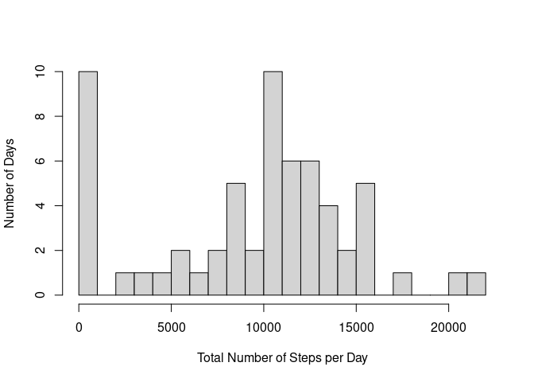
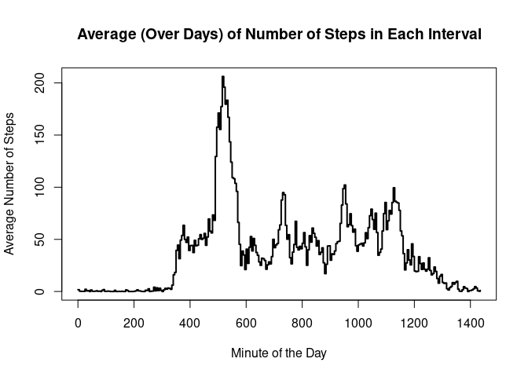
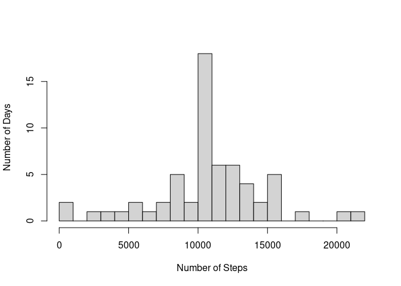
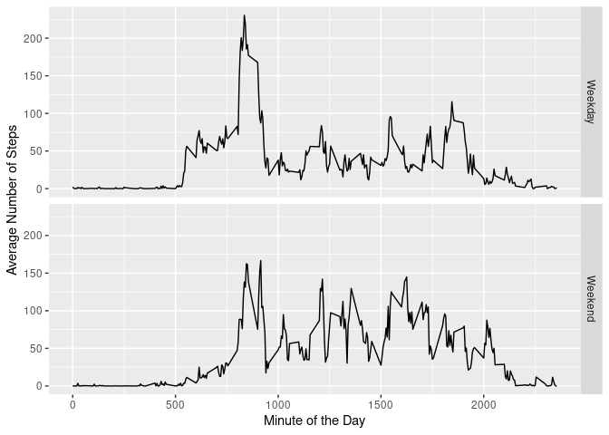

## Loading and preprocessing the data

```r
suppressMessages(library(lubridate))
suppressMessages(library(stringr))
suppressMessages(library(ggplot2))

if (!file.exists('activity.csv')) 
  unzip('./activity.zip')

activity <- read.csv('./activity.csv')
```

The *interval* column of the *activity* data frame is given in the format HHmm, where HH is the hour (i.e. 0 - 23) and mm is the starting minute of each interval (i.e. 0, 5, 10..., 55). In order to clarify, we add a column containing the starting minute of the day (i.e. 0...1435).


```r
minutes <- substring(activity$interval,
                     nchar(activity$interval) - 2 + 1,
                     nchar(activity$interval))
hours <- substring(activity$interval, 1, nchar(activity$interval) - 2)
hours[hours == ''] <- '0'

activity$minute_of_day <- as.numeric(hours) * 60 + as.numeric(minutes)
```

## What is mean total number of steps taken per day?

```r
tot_spd <- tapply(activity$steps, activity$date, sum, na.rm = TRUE)
tot_spd <- data.frame(as.numeric(ymd(names(tot_spd))), tot_spd)
names(tot_spd) <- c('numeric_date', 'steps')

hist(tot_spd$steps, breaks = 20, 
     xlab = 'Total Number of Steps per Day', 
     ylab = 'Number of Days', main = '')
```

<!-- -->

Since it does not make sense to take a fraction of a step, the mean and median daily numbers of steps are rounded.


```r
mean_spd <- round(mean(tot_spd$steps, na.rm = TRUE))
median_spd <- round(median(tot_spd$steps, na.rm = TRUE))

mean_spd <- paste("Mean steps per day:", as.character(mean_spd))
med_spd <- paste("Median steps per day:", as.character(median_spd))
cat(paste(mean_spd, med_spd, sep = '\n'))
```

```
## Mean steps per day: 9354
## Median steps per day: 10395
```

## What is the average daily activity pattern?

```r
ave_spi <- with(activity, aggregate(steps ~ interval + minute_of_day, 
                                    list(interval = interval), 
                                    mean, na.rm = TRUE))

par(mar = c(5.1, 4.1, 4.5, 2.1))
plot(ave_spi$minute_of_day, ave_spi$steps, type = 's', lwd = 2, 
     xlim = range(ave_spi$minute_of_day, na.rm = TRUE), 
     ylim = range(ave_spi$step, na.rm = TRUE), 
     xlab = 'Minute of the Day', ylab = 'Average Number of Steps', 
     main ='Average (Over Days) of Number of Steps in Each Interval')
```

<!-- -->

The interval during which the average number of steps is greatest is 


```r
max_int <- ave_spi[which.max(ave_spi$steps),]

mm <- max_int$minute_of_day%%60
hh <- (max_int$minute_of_day - mm)/60
tme <- paste('(i.e. ', as.character(hh), ':', as.character(mm), ')', sep = '')

interval <- paste('The largest average number of steps occurred during interval number',
                  as.character(which(ave_spi$interval == max_int$interval)))
stps <- paste('During this interval the average number of steps was',
              as.character(round(max_int$steps, 2)))
minute <- paste('This interval began at minute', 
                as.character(max_int$minute_of_day), tme)
hh <- 
cat(paste(interval, stps, minute, sep = '\n'))
```

```
## The largest average number of steps occurred during interval number 104
## During this interval the average number of steps was 206.17
## This interval began at minute 515 (i.e. 8:35)
```

## Imputing missing values
An examination of data frame *activity* shows that data are only missing for the variable *steps*. One also finds that there are rows with *steps* == 0, so *steps* == NA does not simply indicate that no steps were taken.

```r
dates_NA <- sum(is.na(activity$date))
intervals_NA <- sum(is.na(activity$interval))
steps_NA <- sum(is.na(activity$steps))
steps_zero <- sum(activity$steps == 0, na.rm =TRUE)

dates_NA <- paste('Observations with activity$date == NA: ', 
                  as.character(dates_NA))
intervals_NA <- paste('Observations with activity$interval == NA: ', 
                      as.character(intervals_NA))
steps_NA <- paste('Observations with activity$steps == NA: ', 
                  as.character(steps_NA))
steps_zero <- paste('Observations with activity$steps == 0: ', 
                    as.character(steps_zero))

cat(paste(dates_NA, intervals_NA, steps_NA, steps_zero, sep = '\n'))
```

```
## Observations with activity$date == NA:  0
## Observations with activity$interval == NA:  0
## Observations with activity$steps == NA:  2304
## Observations with activity$steps == 0:  11014
```

```r
rm(dates_NA, intervals_NA, steps_NA, steps_zero)
```

Missing *steps* values will be replaced by the mean number of steps taken during that interval.


```r
filler <- function(interval, steps){
  if(!is.na(steps))
    result <- c(steps)
  else
    result <- ave_spi[ave_spi$interval == interval, ]$steps
  
  return(result)
}
  
imputed_activity <- activity
imputed_activity$steps <- mapply(filler, imputed_activity$interval, imputed_activity$steps)
  
tot_imp_spd <- tapply(imputed_activity$steps, imputed_activity$date, sum, na.rm = TRUE)
tot_imp_spd <- data.frame(as.numeric(ymd(names(tot_imp_spd))), tot_imp_spd)
names(tot_imp_spd) <- c('numeric_date', 'steps')
hist(tot_imp_spd$steps, breaks = 20, 
     xlab = 'Number of Steps', 
     ylab = 'Number of Days', 
     main = '')
```

<!-- -->

Since it does not make sense to take a fraction of a step, the mean and median daily numbers of steps (from imputed data) are rounded.


```r
mean_spd <- round(mean(tot_imp_spd$steps))
median_spd <- round(median(tot_imp_spd$steps))

mean_spd <- paste("Mean steps per day:", as.character(mean_spd))
med_spd <- paste("Median steps per day:", as.character(median_spd))
cat(paste(mean_spd, med_spd, sep = '\n'))
```

```
## Mean steps per day: 10766
## Median steps per day: 10766
```

## Are there differences in activity patterns between weekdays and weekends?

```r
weekend <- function(date){
  wkend <- c('Saturday', 'Sunday')
  
  if(weekdays(date) %in% wkend) return('Weekend')
  else return('Weekday')
}

imputed_activity$weekend <- sapply(as.Date(imputed_activity$date), weekend)


ave_imp_spi <- aggregate(steps ~ interval + minute_of_day + weekend, 
                         data = imputed_activity, mean)

ggplot(ave_imp_spi, aes(interval, steps)) + 
  geom_line() + facet_grid(weekend ~ .) + 
  xlab("Minute of the Day") + ylab("Average Number of Steps")
```

<!-- -->
The pattern of steps looks roughly similar for weekends and weekdays, although there are some clear differences. For example, it seems that the subjects were, on average, noticeably less active between about 5:30 am and 7:00 am on weekends than they were on weekdays.
